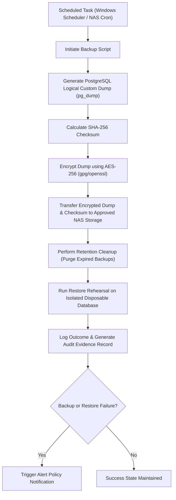

# Backup Automation Architecture

## Overview
This document defines the architectural flow for the automated database backup and recovery pipeline for the SMS v3 application. The architecture is designed to support scheduling on a secure company host (Windows Server or NAS) without exposing connection parameters, keys, or backup contents in source control.

## Logical Architecture Flow

### 1. Scheduled Job Initiation
- **Execution Host**: Future approved Windows Server or corporate NAS.
- **Trigger**: Configured via Windows Task Scheduler or crontab. No schedules are currently active.

### 2. Logical Database Dump
- **Tool**: `pg_dump` with custom binary archive format (`--format=custom`).
- **Connection Configuration**: Database connection secrets must be read dynamically from the execution host's environment, never hardcoded.

### 3. Checksum & Encryption
- **Hash Algorithm**: SHA-256 checksum generated immediately after dump creation.
- **Encryption Algorithm**: AES-256 symmetric encryption using keys managed by the authorized security custodian.

### 4. Storage & Retention
- **Destination**: Restricted directory on the approved NAS storage path.
- **Retention Policy**: Automated purging of backups older than the approved retention days (default placeholder: 30 days).

### 5. Restore Rehearsal & Evidence
- **Rehearsal Flow**: Automated validation script parses the dump to verify custom format integrity and performs dry-run restoration on an isolated, disposable local database instance.
- **Evidence Trail**: Log results appended to a centralized NDJSON audit file on the execution host.
